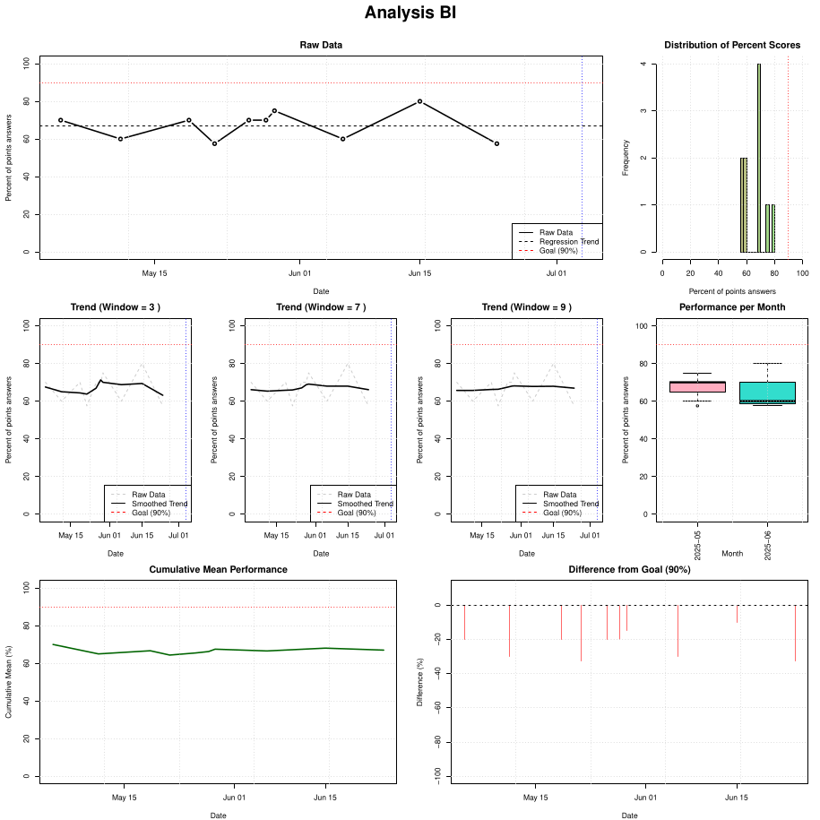
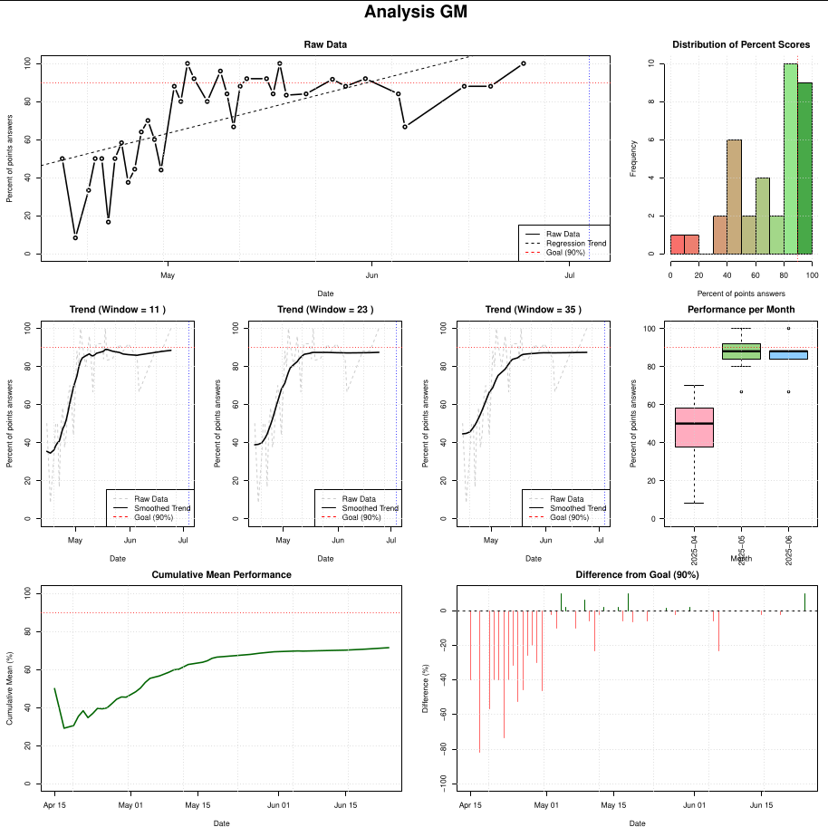

````markdown
# MedAT Analysis

A small terminal-based project I built to simulate the exact timing environment of the Austrian medical admission test (MedAT) using nothing more than Bash and R.

The original idea was simple:

During the real MedAT exam, you do not see a countdown timer.

You only see the current clock time.

That means you constantly have to:

- memorize your start time
- track elapsed time mentally
- decide when to move on
- avoid spending too much time on individual tasks

This sounds trivial until you're under exam pressure.

I wanted a way to train under the exact same timing constraints at home instead of using normal countdown timers that make practice unrealistically easy.

This project replicates that environment.

You choose a MedAT section, memorize your starting time, and then only see a running digital clock exactly like in the real exam setting.

After completing simulations, an R analysis script helps track long-term performance trends.

Everything runs locally.

No GUI  
No online platforms  
No unnecessary complexity  

Just realistic exam preparation.

---

## Supported MedAT sections

The timer currently supports all major MedAT modules:

- `ie` → Implication Recognition  
- `fz` → Figure Assembly  
- `se` → Social Decision Making  
- `zf` → Number Sequences  
- `ph` → Physics  
- `ma` → Mathematics  
- `ch` → Chemistry  
- `wf` → Word Fluency  
- `tv` → Text Comprehension  
- `ee` → Emotion Recognition  
- `er` → Emotion Regulation  
- `gm` → Memory and Recall  
- `bi` → Biology  

Additionally:

- `custom` → create fully custom timers

---

## How it works

### Bash script (`timer.sh`)

The Bash script handles the actual exam simulation:

- lets you choose a MedAT section
- automatically loads official section durations
- starts a countdown
- shows your start time
- hides the start time after a few seconds
- displays only the current digital clock using `figlet`
- plays an alert when time is over

The `gm` module includes the actual two-stage memory structure:

- learning phase
- waiting phase
- recall phase

---

### R script (`analysis.R`)

The R script analyzes your long-term training performance.

It reads your simulation dataset and generates:

- raw performance trends
- regression trends
- rolling averages
- score distributions
- monthly boxplots
- cumulative averages
- distance-to-goal analysis

The analysis output is exported as:

```bash
analysis.pdf
```

---

## Setting your exam date

Inside `analysis.R`, you can define your personal exam date:

```r
exam_date <- "2025-07-04"
```

This adds a vertical reference line to your analysis plots so you can track progress toward your actual test date.

Simply replace it with your own MedAT exam date.

---

## Example workflow

```bash
chmod +x timer.sh
./timer.sh
```

Then:

1. Select your MedAT section
2. Press `ENTER` when ready
3. Memorize your starting time
4. Complete the simulation
5. Review your performance data in R

---

## Example output





---

## Project structure

```bash
.
├── timer.sh
├── analysis.R
├── README.md
├── example_output.png
├── example_output2.png
├── .gitignore
└── LICENSE
```

Generated during runtime:

```bash
data.csv
analysis.pdf
```

---

## Why I built this

Most MedAT preparation tools focus on question banks.

Very few replicate the actual timing pressure of the real exam.

That timing pressure matters.

Many students perform well in practice but struggle during the real test because they are not used to mentally tracking time while solving tasks.

I wanted to train that specific skill.

This project became a combination of:

- exam preparation
- Bash scripting
- automation
- performance tracking
- statistical analysis

And honestly, that combination made it far more fun than standard studying.

---

## Future improvements

Possible additions:

- automated score input
- better visualizations
- historical benchmark comparisons
- GUI version
- adaptive timing simulations
- mobile-compatible version

---

## Requirements

### Bash

- `figlet`

### R

- Base R installation

---

## License

MIT License
